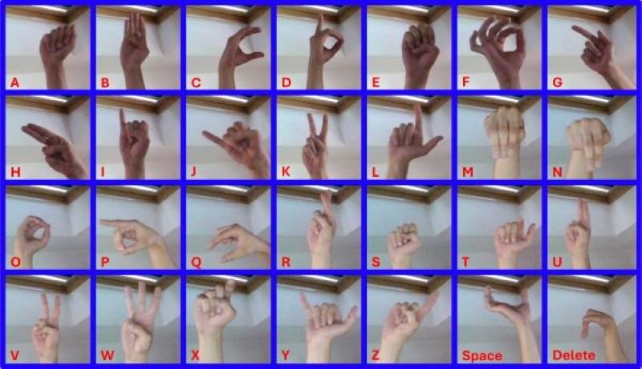

# Master-Studienarbeit
## Handzeichenerkennung - ASL-Alphabet

 

Die aktuelle Version des Programms kann im Repository unter __Releases__ heruntergeladen werden.  
1. Release Name: _Yebra_
2. Download der Datei _v1.1.zip_
3. ZIP-Ordner entpacken
4. Ordner _Yebra_ öffnen
5. Sicherstellen, dass eine Webcam verfügbar ist
6. _Yebra.exe_ ausführen

Falls Windows Defender den Start verhindert, auf "Trotzdem ausführen" klicken.  

Es öffnet sich zunächst ein Konsolenfenster und etwas später die GUI des Programms.  
Der erste Programmstart kann etwas Zeit in Anspruch nehmen.

 

