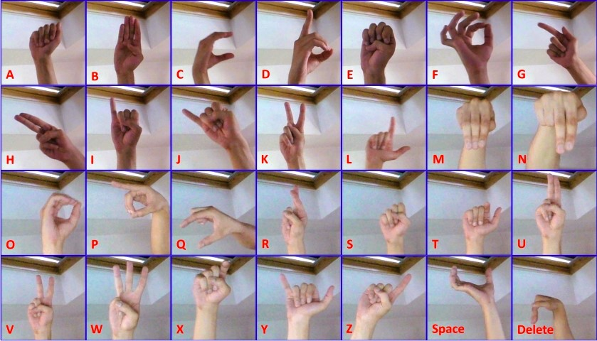

# Master-Studienarbeit
## Handzeichenerkennung - ASL-Alphabet

 

Das Programm kann unter _Releases_ als EXE heruntergeladen werden.
Durch das Ausführen von __Yebra.exe__ wird das Programm gestartet.

 
 

